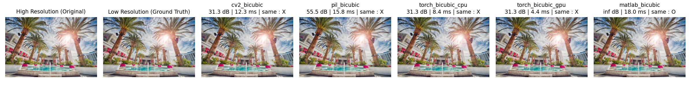

# Bicubic Interpolation 기법 비교

이 저장소는 **DIV2K 고해상도 이미지**를 python 프레임워크와 matlab에서 **Bicubic interpolation 방식**으로 축소(downsampling)하고,  각 기법의 **실행 속도** 및 **PSNR** 을 비교하였습니다.

## 비교 대상 보간 방법

- **OpenCV** (`cv2.INTER_CUBIC`)
- **PIL** (`Image.BICUBIC`)
- **PyTorch** (CPU 및 GPU)
- **SciPy** (`scipy.ndimage.zoom`)
- **MATLAB** (`imresize(..., 'bicubic')`, Python에서 `matlab.engine`으로 호출)

---

## 데이터셋: DIV2K

**DIV2K**는 고화질 이미지 복원(Super-Resolution)을 위한 공개 데이터셋입니다.

- 다운로드 링크: [https://data.vision.ee.ethz.ch/cvl/DIV2K/](https://data.vision.ee.ethz.ch/cvl/DIV2K/)

다른 데이터셋도 이용 가능합니다.


### 디렉토리 구조 예시
```
project_root/
├── data/
│ ├── HR/ # 고해상도 원본 이미지 (예: 0001.png)
│ └── LR/ # 비교용 저해상도 이미지 (예: 0001x2.png)
├── interpolation_method/ 
├── metric/ 
├── asset/ 
└── main.py # 실행 스크립트
```

---

## 결과 예시


대부분의 Python 기반 라이브러리는 서로 유사한 PSNR 값을 보였으며, MATLAB의 `imresize(..., 'bicubic')` 방식은 DIV2K 등 주요 Super Resolution 논문에서 사용하는 표준 보간 방식으로, 실제 저해상도 이미지 생성 시 가장 많이 사용되는 기준 방식임을 알 수 있었다.

---

##  참고 사항

- MATLAB 사용을 위해서는 Python에서 `matlab.engine` 설치가 필요합니다.
```
cd "%MATLAB_ROOT%\extern\engines\python"
python setup.py install
```

%MATLAB_ROOT% : matlab 설치 경로

## 실행 방법

```bash
python main.py
```
